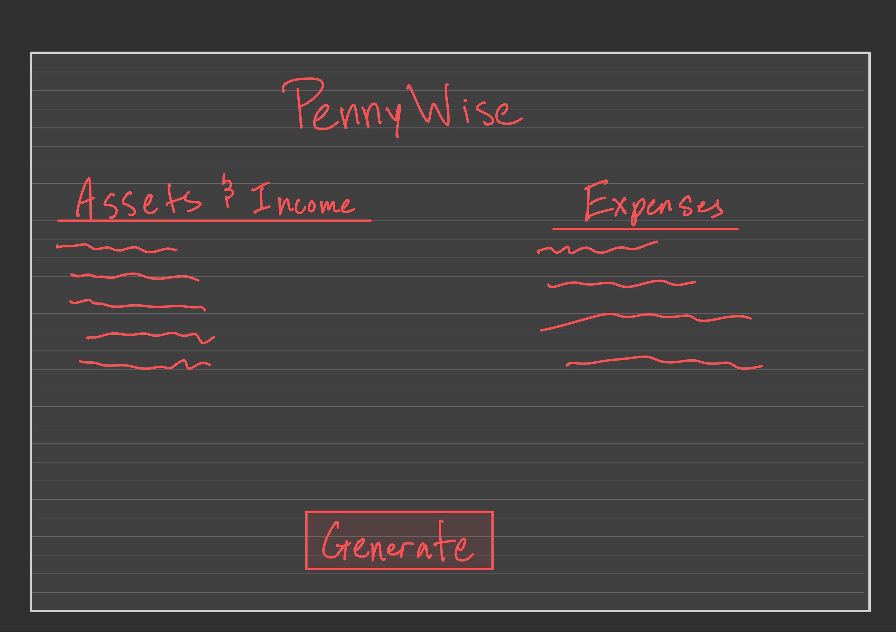
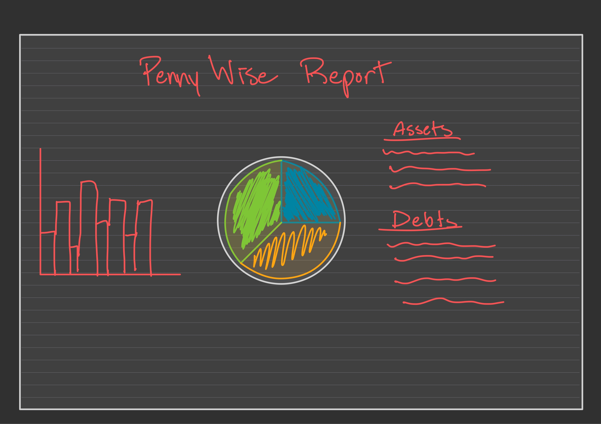
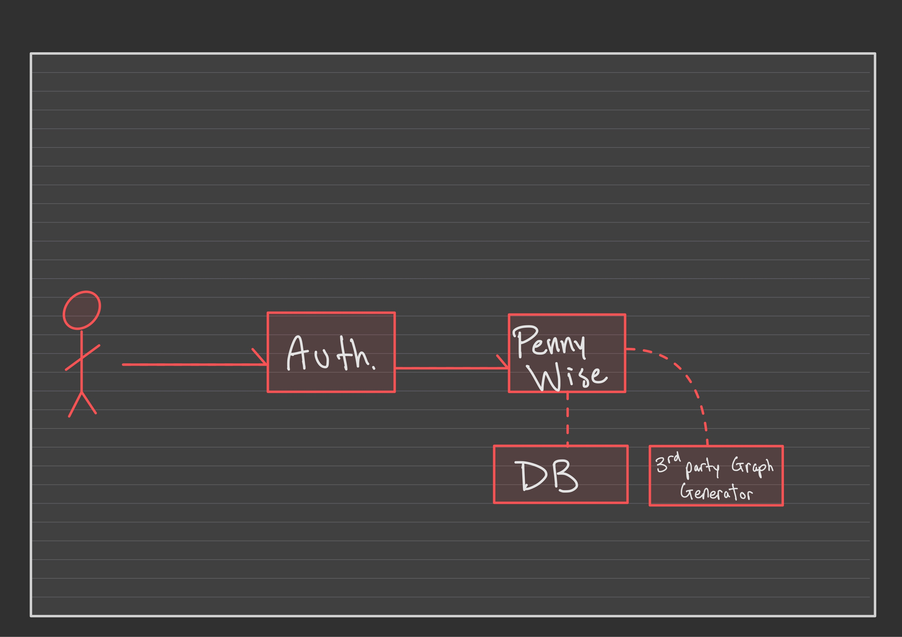

# PennyWise

[My Notes](notes.md)

PennyWise is a personal budget generator. Input all Income and Assets as well as your Expenses and Debt and it will display all this information for you in a clean and aesthetic way. It will show you how much money you have left over after all expenses are paid. It will allow you to configure the fields in both Assets and Expenses and add limits to the field so that when you enter your current expenses it will show you where you are over and under budget. Once all the necessary information is inserted, it will generate a monthly budget starting with the current month and going 12-months into the future (considering adding a payoff calculator for the debts.)

### Elevator pitch

Meet PennyWise, your smart personal budget generator. Simply enter your income, assets, expenses, and debts, and PennyWise instantly organizes your finances in a clean, intuitive dashboard. It shows you exactly how much you have left after paying expenses, where you’re over or under budget, and even projects a 12-month budget tailored to you. With customizable fields, spending limits, and a built-in debt payoff calculator, PennyWise doesn’t just track your money—it helps you take control of it.

### Design

### Sequence Diagram

### Key features

- Budget Generation
- Financial Report
- Loan Payoff Calculator

### Technologies

I am going to use the required technologies in the following ways.

- **HTML** - PennyWise will utilize modern HTML structures and practices. 
- **CSS** - PennyWise will be a clean and simple dashboard that embraces open space rather than crowding the page with useless information. The graphs will be animated as they generate and the buttons will have a click animation to immerse the user into the experience. 
- **React:** 
  - Will be used to break up PennyWise into reusable components so that everything feels interconnected. 
  - Quicker updates using Virtual DOM. Instead of reloading the entire page for a small update, it will just update that small portion. 
  - State Management
- **Service** - backend server with end-points for:
  - Storing user input (login, logout, and persistent data).
  - Communicating with third-party apps that generate user graphs. 
- **DB/Login** - Stores Users and their financial information. 
- **WebSocket** - If the user permits, their personal budget can be shared with other users. 

## 🚀 AWS deliverable

For this deliverable I did the following. I checked the box `[x]` and added a description for things I completed.

- [ ] **Server deployed and accessible with custom domain name** - [My server link](https://yourdomainnamehere.click).

## 🚀 HTML deliverable

For this deliverable I did the following. I checked the box `[x]` and added a description for things I completed.

- [ ] **HTML pages** - I did not complete this part of the deliverable.
- [ ] **Proper HTML element usage** - I did not complete this part of the deliverable.
- [ ] **Links** - I did not complete this part of the deliverable.
- [ ] **Text** - I did not complete this part of the deliverable.
- [ ] **3rd party API placeholder** - I did not complete this part of the deliverable.
- [ ] **Images** - I did not complete this part of the deliverable.
- [ ] **Login placeholder** - I did not complete this part of the deliverable.
- [ ] **DB data placeholder** - I did not complete this part of the deliverable.
- [ ] **WebSocket placeholder** - I did not complete this part of the deliverable.

## 🚀 CSS deliverable

For this deliverable I did the following. I checked the box `[x]` and added a description for things I completed.

- [ ] **Header, footer, and main content body** - I did not complete this part of the deliverable.
- [ ] **Navigation elements** - I did not complete this part of the deliverable.
- [ ] **Responsive to window resizing** - I did not complete this part of the deliverable.
- [ ] **Application elements** - I did not complete this part of the deliverable.
- [ ] **Application text content** - I did not complete this part of the deliverable.
- [ ] **Application images** - I did not complete this part of the deliverable.

## 🚀 React part 1: Routing deliverable

For this deliverable I did the following. I checked the box `[x]` and added a description for things I completed.

- [ ] **Bundled using Vite** - I did not complete this part of the deliverable.
- [ ] **Components** - I did not complete this part of the deliverable.
- [ ] **Router** - I did not complete this part of the deliverable.

## 🚀 React part 2: Reactivity deliverable

For this deliverable I did the following. I checked the box `[x]` and added a description for things I completed.

- [ ] **All functionality implemented or mocked out** - I did not complete this part of the deliverable.
- [ ] **Hooks** - I did not complete this part of the deliverable.

## 🚀 Service deliverable

For this deliverable I did the following. I checked the box `[x]` and added a description for things I completed.

- [ ] **Node.js/Express HTTP service** - I did not complete this part of the deliverable.
- [ ] **Static middleware for frontend** - I did not complete this part of the deliverable.
- [ ] **Calls to third party endpoints** - I did not complete this part of the deliverable.
- [ ] **Backend service endpoints** - I did not complete this part of the deliverable.
- [ ] **Frontend calls service endpoints** - I did not complete this part of the deliverable.
- [ ] **Supports registration, login, logout, and restricted endpoint** - I did not complete this part of the deliverable.

## 🚀 DB deliverable

For this deliverable I did the following. I checked the box `[x]` and added a description for things I completed.

- [ ] **Stores data in MongoDB** - I did not complete this part of the deliverable.
- [ ] **Stores credentials in MongoDB** - I did not complete this part of the deliverable.

## 🚀 WebSocket deliverable

For this deliverable I did the following. I checked the box `[x]` and added a description for things I completed.

- [ ] **Backend listens for WebSocket connection** - I did not complete this part of the deliverable.
- [ ] **Frontend makes WebSocket connection** - I did not complete this part of the deliverable.
- [ ] **Data sent over WebSocket connection** - I did not complete this part of the deliverable.
- [ ] **WebSocket data displayed** - I did not complete this part of the deliverable.
- [ ] **Application is fully functional** - I did not complete this part of the deliverable.

